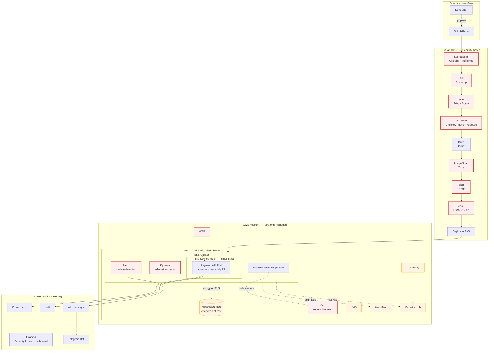

# SecurePay Platform

> Production-grade DevSecOps platform for a fintech payment microservice — with **shift-left security**, **defence-in-depth** on Kubernetes, and **live attack demos** proving each control actually blocks what it claims to block.


[](https://gitlab.com/poxka/spp/-/pipelines)


---

## TL;DR

A payment API surrounded by a secure platform that is built end-to-end:

- **Multi-layered CI/CD security pipeline** — SAST, SCA, secret scanning, IaC scanning, container scanning, DAST, image signing.
- **Hardened AWS + EKS foundation** — Terraform-managed VPC, IAM with IRSA, KMS, GuardDuty, CloudTrail, Security Hub.
- **Kubernetes defence-in-depth** — RBAC by team, Network Policies, Pod Security Admission, Kyverno admission control, Falco runtime detection.
- **Zero-trust networking** — Istio mTLS strict mode, `AuthorizationPolicy` per service.
- **Secrets** — HashiCorp Vault + External Secrets Operator + IRSA.
- **PCI DSS mapping** — every control traced to the requirement it satisfies.
- **Attack scenarios** — a parallel `vulnerable-demo` branch proves each control does its job.

---

## Table of Contents

- [Why this project?](#why-this-project)
- [Architecture](#architecture)
- [The SecurePay Application](#the-securepay-application)
- [Security controls](#security-controls)
- [Attack scenarios](#attack-scenarios)
- [Layouts](#layouts)
- [Stack](#stack)
- [PCI DSS mapping](#pci-dss-mapping)
- [Documentation](#documentation)
- [Roadmap](#roadmap)
- [About Me](#about-me)

---

## Why this project?

This portfolio shows **a stack that provably works** against real attacker behaviour.

The scenario: build a full secure platform around a new payment API. Constraints match a real fintech environment — **PCI DSS applies**, blast radius must be minimised, secrets must never touch a repo, every deployment must pass through automated security gates, and runtime behaviour must be observable.

---

## Architecture



---

## The SecurePay Application

A minimal FastAPI-based payment service — a realistic target for the security tooling.

**Endpoints:**

- `POST /transactions` — create a transaction (`amount`, `currency`, `card_token`)
- `GET /transactions/{id}` — fetch one
- `GET /transactions` — list with filters
- `POST /auth/login` — JWT
- `GET /health`, `GET /metrics` — for K8s probes and Prometheus

**No real cardholder data:** `card_token` is a UUID reference to a stored card.

**Two branches, one purpose:**

| Branch              | Purpose                                                                                             |
| ------------------- | --------------------------------------------------------------------------------------------------- |
| `main`              | Hardened reference implementation. Passes every pipeline gate.                                      |
| `vulnerable-demo`   | Same API with deliberately planted vulnerabilities. To catch them all.                              |

Locally the DB is a container; in AWS it's KMS-encrypted RDS.

---

## Security controls

| Layer                    | Controls                                                                                          |
| ------------------------ | ------------------------------------------------------------------------------------------------- |
| **Source code**          | Semgrep SAST, Gitleaks & TruffleHog secret detection, pre-commit hooks                            |
| **Dependencies**         | Trivy & Grype SCA, dependency pinning                                                             |
| **Infrastructure code**  | Checkov, tfsec, Kubesec                                                                           |
| **Container image**      | Non-root user, minimal base (distroless/slim), Trivy image scan, Cosign signing, admission verification          |
| **Kubernetes cluster**   | RBAC (`dev` / `ops` / `security` / `audit`), Pod Security Admission `restricted`, Kyverno policies, OPA/Gatekeeper evaluated |
| **Network**              | Network Policies default-deny (Calico/Cilium), Istio `mTLS STRICT`, `AuthorizationPolicy` per workload   |
| **Secrets**              | Vault + External Secrets Operator + IRSA                                                          |
| **Runtime**              | Falco rules for common attacker TTPs, alerts to Telegram via Alertmanager                         |
| **Cloud plane**          | CloudTrail, GuardDuty, Config, Security Hub, KMS-encrypted state and volumes                      |
| **Edge**                 | AWS WAF, rate limiting, security headers (HSTS, CSP)                                              |

---

## Attack scenarios

Each scenario has a recorded screencast in [`docs/demos/`](./docs/demos/).

| #  | Scenario                                  | Attacker action                        | Control that blocks                      | Layer         |
| -- | ----------------------------------------- | -------------------------------------- | ---------------------------------------- | ------------- |
| 1  | Committing a hardcoded AWS key            | `git push` with credentials in code    | Gitleaks (pre-commit + CI)               | Source        |
| 2  | SQL injection                             | Raw string concatenation in a query    | Semgrep SAST                             | Source        |
| 3  | JWT bypass with `alg: none`               | Forged token, weak validation on branch| Semgrep SAST gate                        | Source        |
| 4  | Dependency with a known critical CVE      | Pinning a vulnerable package           | Trivy / Grype SCA                        | Dependencies  |
| 5  | Terraform with open SG / `iam:*`          | Permissive rule in IaC                 | Checkov / tfsec                          | IaC           |
| 6  | Image with CVE / running as root          | `USER root`, outdated base             | Trivy image scan + Kyverno at admission  | Image         |
| 7  | Deploying an unsigned / untrusted image   | Push image from outside the pipeline   | Cosign + Kyverno `verifyImages`          | Supply chain  |
| 8  | Deploying a privileged pod                | `privileged: true` in manifest         | Kyverno policy + Pod Security Admission  | Cluster       |
| 9  | Lateral movement from a compromised pod   | `curl` to another namespace            | Network Policy default-deny + Falco alert| Network       |
| 10 | Runtime shell spawn in a container        | `kubectl exec` + `sh` in payment pod   | Falco rule → Telegram alert              | Runtime       |
| 11 | Plaintext / wrong-identity mesh call      | Non-mTLS or unauthorized service call  | Istio mTLS strict + `AuthorizationPolicy`| Mesh          |
| 12 | SQLi at the edge                          | Malicious payload to the ingress       | AWS WAF managed rules                    | Edge          |
| 13 | Anomalous AWS account activity            | Unusual API calls / recon              | GuardDuty → Security Hub                 | Cloud         |

Each scenario is a small git commit on `vulnerable-demo`, run through the pipeline, with the block point captured on video.

---

## Layouts

```securepay-platform/
├── app/                      # Payment API (FastAPI)
│   ├── src/
│   ├── tests/
│   ├── Dockerfile            # multi-stage, non-root, read-only FS, pinned base
│   └── docker-compose.yml    # local: API + PostgreSQL
├── infra/
│   └── terraform/
│       ├── modules/
│       │   ├── vpc/
│       │   ├── eks/
│       │   ├── iam/
│       │   ├── kms/
│       │   └── rds/          # PostgreSQL — KMS-encrypted, TLS-only, private subnet
│       └── envs/
│           └── dev/          # apply / destroy in bursts
├── k8s/
│   ├── base/                 # Deployment, Service, ServiceAccount, NetworkPolicy
│   ├── policies/
│   │   ├── kyverno/
│   │   └── gatekeeper/       # comparison
│   ├── rbac/                 # dev / ops / security / audit
│   ├── istio/                # PeerAuthentication, AuthorizationPolicy
│   └── vault/                # External Secrets Operator, SecretStore
├── observability/            # prometheus, grafana dashboards, loki, alertmanager
├── security/
│   ├── falco/                # rules + alerting
│   ├── scripts/              # Python: boto3 automation, Telegram bot
│   └── policies/             # semgrep rules, OPA rego
├── docs/
│   ├── architecture.md
│   ├── threat-model.md       # STRIDE
│   ├── pci-dss-mapping.md
│   ├── adr/                  # Architecture Decision Records
│   ├── runbooks/
│   ├── security-chaos.md
│   └── demos/                # screencasts of attack scenarios
├── .gitlab-ci.yml
├── .pre-commit-config.yaml
├── LICENSE
└── README.md
```

---

## Stack

<table>
<tr><td><b>Cloud</b></td><td>AWS — EKS, VPC, IAM, KMS, S3, Lambda, CloudTrail, GuardDuty, Config, Security Hub, WAF</td></tr>
<tr><td><b>IaC</b></td><td>Terraform (S3+DynamoDB backend, KMS-encrypted state)</td></tr>
<tr><td><b>Orchestration</b></td><td>Kubernetes (EKS), Kyverno, Falco, External Secrets Operator</td></tr>
<tr><td><b>Service Mesh</b></td><td>Istio — mTLS strict, AuthorizationPolicy, PeerAuthentication</td></tr>
<tr><td><b>Secrets</b></td><td>HashiCorp Vault + External Secrets Operator + IRSA</td></tr>
<tr><td><b>CI/CD</b></td><td>GitLab CI</td></tr>
<tr><td><b>Security tooling</b></td><td>Semgrep, Trivy, Grype, Gitleaks, TruffleHog, Checkov, tfsec, Kubesec, OWASP ZAP, Cosign, OPA/Gatekeeper</td></tr>
<tr><td><b>Observability</b></td><td>Prometheus, Grafana, Loki, Alertmanager</td></tr>
<tr><td><b>Application</b></td><td>Python 3.12, FastAPI, SQLAlchemy, PostgreSQL, JWT</td></tr>
<tr><td><b>Local dev</b></td><td>Docker Compose, kind/minikube, pre-commit, Vault dev-mode</td></tr>
</table>

---

## PCI DSS mapping

Every control in this project is traced to the PCI DSS requirement it helps satisfy. Full mapping in [`docs/pci-dss-mapping.md`](./docs/pci-dss-mapping.md). Excerpt:

| PCI DSS Requirement                                              | Implementation in this project                                    |
| ---------------------------------------------------------------- | ----------------------------------------------------------------- |
| Req 1 — Network segmentation                                     | VPC subnets, Security Groups, Network Policies (Calico/Cilium)     |
| Req 2 — No vendor defaults, harden systems                       | Non-root containers, minimal base (distroless/slim), PSA `restricted` |
| Req 3 — Protect stored cardholder data                           | Tokenization (no PANs stored), KMS encryption at rest              |
| Req 4 — Encrypt transmission                                     | Istio mTLS strict, TLS on RDS, HSTS                                |
| Req 5 — Protect against malware / malicious activity             | Falco runtime detection                                            |
| Req 6 — Develop secure systems                                   | SAST, SCA, IaC scanning, secure SDLC                               |
| Req 7 — Restrict access by need-to-know                          | RBAC by team, IAM least privilege, IRSA                            |
| Req 8 — Identify and authenticate access                         | JWT (app auth), IRSA (workload identity), IAM least-privilege      |
| Req 10 — Log and monitor                                         | CloudTrail, K8s audit logs to Loki, Falco alerts                   |
| Req 11 — Test security regularly                                 | DAST in pipeline, chaos scenarios documented                       |

---

## Documentation

- [`docs/architecture.md`](./docs/architecture.md) — full architecture
- [`docs/threat-model.md`](./docs/threat-model.md) — STRIDE model for the payment API
- [`docs/pci-dss-mapping.md`](./docs/pci-dss-mapping.md) — PCI DSS control mapping
- [`docs/adr/`](./docs/adr/) — Architecture Decision Records
- [`docs/runbooks/`](./docs/runbooks/) — incident response procedures
- [`docs/security-chaos.md`](./docs/security-chaos.md) — chaos-engineering log
- [`docs/demos/`](./docs/demos/) — attack screencasts

---

## Roadmap

- [x] **Phase 0 — Foundation & repo hygiene**
  - [x] Repo structure, README skeleton, ADR template
  - [x] pre-commit hooks (gitleaks, markdownlint) from the first commit
  - [x] `security-chaos.md` skeleton, conventional commits
- [x] **Phase 1 — Payment API & local dev**
  - [x] FastAPI service (`main`) with secure defaults
  - [x] `vulnerable-demo` branch with planted vulnerabilities (separate commits)
  - [x] docker-compose (API + PostgreSQL)
  - [x] STRIDE threat model (draft)
- [x] **Phase 2 — Secure containerization**
  - [x] Multi-stage Dockerfile: non-root, read-only FS, pinned base digest
  - [x] Local Trivy image scan
- [x] **Phase 3 — CI security pipeline (shift-left gates)**
  - [x] GitLab pipeline: secret scan → SAST → SCA → container scan
  - [x] Fail-closed gates with tuned severity thresholds
  - [x] First attack-scenario screencasts (secret, SQLi, CVE, image)
- [ ] **Phase 4 — IaC & AWS foundation**
  - [ ] AWS Budgets + billing alerts
  - [ ] Terraform backend (S3 + DynamoDB lock, KMS-encrypted)
  - [ ] Modules: VPC, IAM, KMS, RDS
  - [ ] IaC scanning in CI (Checkov, tfsec, Kubesec)
- [ ] **Phase 5 — EKS & baseline Kubernetes security**
  - [ ] Policies developed in kind, validated on EKS
  - [ ] EKS via Terraform; RBAC by team (dev/ops/security/audit)
  - [ ] Pod Security Admission `restricted`
  - [ ] Network Policies default-deny (Calico/Cilium — ADR)
- [ ] **Phase 6 — Admission & supply chain**
  - [ ] Kyverno policies (non-root, limits, no `latest`, no privileged, signed images)
  - [ ] OPA/Gatekeeper comparison (ADR)
  - [ ] Cosign signing in CI + Kyverno `verifyImages` at admission
- [ ] **Phase 7 — Secrets management**
  - [ ] Vault (dev-mode local → cluster)
  - [ ] External Secrets Operator + IRSA
  - [ ] Secret rotation demo
- [ ] **Phase 8 — Service mesh (zero-trust)**
  - [ ] Istio install, mTLS `STRICT`, PeerAuthentication
  - [ ] AuthorizationPolicy default-deny per workload
- [ ] **Phase 9 — Runtime security**
  - [ ] Falco rules for attacker TTPs
  - [ ] Falco → Alertmanager → Telegram (Python bot)
- [ ] **Phase 10 — DAST & dynamic testing**
  - [ ] OWASP ZAP against the OpenAPI spec (manual/scheduled — CI minutes)
- [ ] **Phase 11 — Observability**
  - [ ] Prometheus + Grafana "Security Posture" dashboard
  - [ ] Loki + K8s/Vault audit-log pipeline
- [ ] **Phase 12 — AWS cloud security services**
  - [ ] CloudTrail, GuardDuty, AWS Config
  - [ ] Security Hub (PCI DSS standard), AWS WAF
- [ ] **Phase 13 — Docs, threat model & demo consolidation**
  - [ ] Finalize STRIDE, PCI mapping, ADRs, runbooks
  - [ ] Record & embed all attack-scenario screencasts
  - [ ] Polish public README

---

## About Me

I'm building this as a hands-on portfolio of the DevSecOps skills needed in a fintech environment: shift-left security, defence-in-depth on Kubernetes, secure cloud foundations, and — most importantly — the mindset of thinking like both attacker and defender.

Background: several years of Linux/network administration, several years of Python backend development. Currently transitioning fully into DevSecOps, with this project as the demonstration piece.

---

<sub>Built as a portfolio project. No real cardholder data is processed anywhere in this project.</sub>
