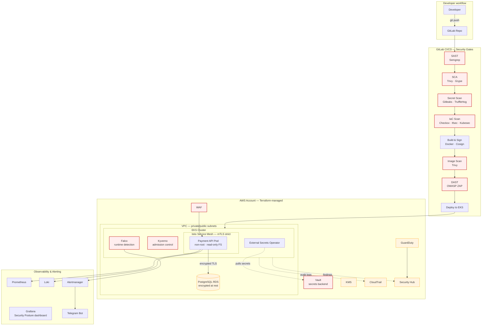

# SecurePay Platform

> Production-grade DevSecOps platform for a fintech payment microservice — with **shift-left security**, **defence-in-depth** on Kubernetes, and **live attack demos** proving each control actually blocks what it claims to block.


---

## TL;DR

A payment API is only as secure as the platform around it. This project builds that platform end-to-end:

- **Multi-layered CI/CD security pipeline** — SAST, SCA, secret scanning, IaC scanning, container scanning, DAST, image signing.
- **Hardened AWS + EKS foundation** — Terraform-managed VPC, IAM with IRSA, KMS, GuardDuty, CloudTrail, Security Hub.
- **Kubernetes defence-in-depth** — RBAC by team, Network Policies, Pod Security Admission, Kyverno admission control, Falco runtime detection.
- **Zero-trust networking** — Istio mTLS strict mode, `AuthorizationPolicy` per service.
- **Secrets done right** — HashiCorp Vault + External Secrets Operator + IRSA. No secrets in Git, ever.
- **PCI DSS mapping** — every control traced to the requirement it satisfies.
- **Live attack scenarios** — a parallel `vulnerable-demo` branch proves each control catches what it should.

**The selling point isn't "I set up the stack" — it's "here's a screencast of the pipeline blocking a hardcoded AWS key, a container with a critical CVE, a privileged pod, and a lateral-movement attempt from a compromised container."**

---

## Table of Contents

- [Why this project](#why-this-project)
- [Architecture](#architecture)
- [The application under protection](#the-application-under-protection)
- [Security controls at a glance](#security-controls-at-a-glance)
- [Demo attack scenarios](#demo-attack-scenarios)
- [Repository layout](#repository-layout)
- [Tech stack](#tech-stack)
- [PCI DSS mapping](#pci-dss-mapping)
- [Documentation](#documentation)
- [Roadmap](#roadmap)
- [About the author](#about-the-author)

---

## Why this project

Most DevSecOps portfolios show a stack. This one shows **a stack that provably works** against real attacker behaviour.

The scenario: I'm the DevSecOps engineer at a fictional fintech, tasked with building the full secure platform around a new payment API. Constraints match a real fintech environment — **PCI DSS applies**, blast radius must be minimised, secrets must never touch a repo, every deployment must pass through automated security gates, and runtime behaviour must be observable.

Rather than treating the application as the centre of the project, the API is deliberately minimal — just enough surface area for security tooling to have something meaningful to protect. **The platform is the product.**

---

## Architecture



---

## The application under protection

A minimal FastAPI-based payment service. **Not the point of the project** — but a realistic target for the security tooling.

**Endpoints:**
- `POST /transactions` — create a transaction (`amount`, `currency`, `card_token`)
- `GET /transactions/{id}` — fetch one
- `GET /transactions` — list with filters
- `POST /auth/login` — JWT
- `GET /health`, `GET /metrics` — for K8s probes and Prometheus

**PCI mindset from day one:** no real PANs anywhere. Transactions reference **tokenized card IDs** (UUIDs pointing to a hypothetical PCI-scoped vault we don't operate). This is itself a PCI DSS pattern — **scope reduction through tokenization**.

**Two branches, one purpose:**

| Branch              | Purpose                                                                                             |
| ------------------- | --------------------------------------------------------------------------------------------------- |
| `main`              | Hardened reference implementation. Passes every pipeline gate.                                      |
| `vulnerable-demo`   | Same API with deliberately planted vulnerabilities. Used to prove each security control blocks it. |

---

## Security controls at a glance

| Layer                    | Controls                                                                                          |
| ------------------------ | ------------------------------------------------------------------------------------------------- |
| **Source code**          | Semgrep SAST, Gitleaks & TruffleHog secret detection, pre-commit hooks                            |
| **Dependencies**         | Trivy & Grype SCA, dependency pinning                                                             |
| **Infrastructure code**  | Checkov, tfsec, Kubesec — every Terraform and manifest scanned                                    |
| **Container image**      | Non-root user, distroless base, Trivy image scan, Cosign signing, admission verification          |
| **Kubernetes cluster**   | RBAC (`dev` / `ops` / `security` / `audit`), Pod Security Admission `restricted`, Kyverno policies |
| **Network**              | Calico Network Policies (default-deny), Istio `mTLS STRICT`, `AuthorizationPolicy` per workload   |
| **Secrets**              | Vault + External Secrets Operator + IRSA — no static credentials, ever                            |
| **Runtime**              | Falco rules for common attacker TTPs, alerts routed to Telegram via Alertmanager                  |
| **Cloud plane**          | CloudTrail, GuardDuty, Config, Security Hub, KMS-encrypted state and volumes                      |
| **Edge**                 | AWS WAF, rate limiting, security headers (HSTS, CSP)                                              |

---

## Demo attack scenarios

The killer feature. Each scenario has a recorded screencast in [`docs/demos/`](./docs/demos/).

| # | Scenario                                              | Attacker action                             | Control that blocks                       | Layer          |
| - | ----------------------------------------------------- | ------------------------------------------- | ----------------------------------------- | -------------- |
| 1 | Committing a hardcoded AWS key                        | `git push` with credentials in code         | Gitleaks in pre-commit + CI               | Source         |
| 2 | Introducing a SQL injection                           | Raw string concatenation in a query         | Semgrep SAST rule                         | Source         |
| 3 | Using a dependency with a known critical CVE          | Pinning a vulnerable package version        | Trivy SCA gate                            | Dependencies   |
| 4 | Pushing an image running as root                      | `USER root` in Dockerfile                   | Trivy config scan + Kyverno at admission  | Image / Cluster |
| 5 | Deploying a privileged pod                            | `privileged: true` in manifest              | Kyverno policy + Pod Security Admission   | Cluster        |
| 6 | Lateral movement from a compromised pod               | `curl` to another namespace                 | Calico Network Policy (default-deny)      | Network        |
| 7 | Runtime shell spawn inside a container                | `kubectl exec` + `sh` in payment pod        | Falco rule → Telegram alert               | Runtime        |
| 8 | Bypassing JWT with `alg: none`                        | Forged token in `vulnerable-demo`           | Hardened JWT validation in `main`         | Application    |
| 9 | Unauthenticated access to admin endpoint              | Direct HTTP request                         | Istio `AuthorizationPolicy`               | Mesh           |

Each scenario is a small git commit on `vulnerable-demo`, run through the pipeline, with the block point captured on video. **This is the interview centrepiece.**

---

## Repository layout

```
securepay-platform/
├── app/                    # Payment API (FastAPI)
│   ├── src/
│   ├── tests/
│   └── Dockerfile          # multi-stage, distroless, non-root
├── infra/                  # Terraform — AWS foundation
│   ├── modules/
│   │   ├── vpc/
│   │   ├── eks/
│   │   ├── iam/
│   │   └── kms/
│   └── environments/
├── k8s/                    # Kubernetes manifests / Helm
│   ├── base/
│   ├── kyverno-policies/
│   ├── network-policies/
│   ├── istio/
│   └── falco-rules/
├── ci/                     # GitLab CI pipeline components
│   └── security-stages/
├── scripts/                # Python automation (boto3, alerting)
├── docs/
│   ├── architecture.md
│   ├── threat-model.md     # STRIDE
│   ├── pci-dss-mapping.md
│   ├── adr/                # Architecture Decision Records
│   ├── runbooks/
│   ├── security-chaos.md
│   └── demos/              # Screencasts of attack scenarios
└── README.md
```

---

## Tech stack

<table>
<tr><td><b>Cloud</b></td><td>AWS — EKS, VPC, IAM, KMS, S3, Lambda, CloudTrail, GuardDuty, Config, Security Hub, WAF</td></tr>
<tr><td><b>IaC</b></td><td>Terraform (S3+DynamoDB backend, KMS-encrypted state)</td></tr>
<tr><td><b>Orchestration</b></td><td>Kubernetes (EKS), Kyverno, Falco, External Secrets Operator</td></tr>
<tr><td><b>Service Mesh</b></td><td>Istio — mTLS strict, AuthorizationPolicy, PeerAuthentication</td></tr>
<tr><td><b>Secrets</b></td><td>HashiCorp Vault + IRSA</td></tr>
<tr><td><b>CI/CD</b></td><td>GitLab CI</td></tr>
<tr><td><b>Security tooling</b></td><td>Semgrep, Trivy, Grype, Gitleaks, TruffleHog, Checkov, tfsec, Kubesec, OWASP ZAP, Cosign, OPA</td></tr>
<tr><td><b>Observability</b></td><td>Prometheus, Grafana, Loki, Alertmanager</td></tr>
<tr><td><b>Application</b></td><td>Python 3.12, FastAPI, SQLAlchemy, PostgreSQL, JWT</td></tr>
</table>

---

## PCI DSS mapping

Every control in this project is traced to the PCI DSS requirement it helps satisfy. Full mapping in [`docs/pci-dss-mapping.md`](./docs/pci-dss-mapping.md). Excerpt:

| PCI DSS Requirement                                              | Implementation in this project                                    |
| ---------------------------------------------------------------- | ----------------------------------------------------------------- |
| Req 1 — Network segmentation                                     | VPC subnets, Security Groups, Calico Network Policies              |
| Req 2 — No vendor defaults, harden systems                       | Non-root containers, distroless base, PSA `restricted`             |
| Req 3 — Protect stored cardholder data                           | Tokenization (no PANs stored), KMS encryption at rest              |
| Req 4 — Encrypt transmission                                     | Istio mTLS strict, TLS on RDS, HSTS                                |
| Req 6 — Develop secure systems                                   | SAST, SCA, IaC scanning, secure SDLC                               |
| Req 7 — Restrict access by need-to-know                          | RBAC by team, IAM least privilege, IRSA                            |
| Req 8 — Identify and authenticate access                         | JWT, MFA-required IAM policies                                     |
| Req 10 — Log and monitor                                         | CloudTrail, K8s audit logs to Loki, Falco alerts                   |
| Req 11 — Test security regularly                                 | DAST in pipeline, chaos scenarios documented                       |

---

## Documentation

- [`docs/architecture.md`](./docs/architecture.md) — full architecture write-up
- [`docs/threat-model.md`](./docs/threat-model.md) — STRIDE model for the payment API
- [`docs/pci-dss-mapping.md`](./docs/pci-dss-mapping.md) — PCI DSS control mapping
- [`docs/adr/`](./docs/adr/) — Architecture Decision Records (Kyverno vs Gatekeeper, Istio vs Linkerd, Vault vs AWS Secrets Manager, etc.)
- [`docs/runbooks/`](./docs/runbooks/) — incident response procedures
- [`docs/security-chaos.md`](./docs/security-chaos.md) — chaos-engineering log
- [`docs/demos/`](./docs/demos/) — attack scenario screencasts

---

## Roadmap

- [ ] **Phase 1 — Application & local dev**
  - [ ] FastAPI payment service (`main` branch)
  - [ ] `vulnerable-demo` branch with planted vulnerabilities
  - [ ] docker-compose local stack (API + PostgreSQL + Vault dev-mode)
  - [ ] STRIDE threat model
- [ ] **Phase 2 — IaC foundation**
  - [ ] Terraform modules: VPC, IAM, KMS
  - [ ] Terraform backend (S3 + DynamoDB lock, KMS-encrypted)
  - [ ] pre-commit hooks (tfsec, Checkov)
- [ ] **Phase 3 — EKS & core security**
  - [ ] EKS cluster via Terraform
  - [ ] RBAC by team
  - [ ] Pod Security Admission `restricted`
  - [ ] Calico Network Policies (default-deny)
- [ ] **Phase 4 — Admission & runtime**
  - [ ] Kyverno policies (image signing, non-root, resource limits, forbidden namespaces)
  - [ ] Falco rules + Telegram alerting
  - [ ] Vault + External Secrets Operator + IRSA
- [ ] **Phase 5 — Service mesh**
  - [ ] Istio install
  - [ ] mTLS strict
  - [ ] AuthorizationPolicy per workload
- [ ] **Phase 6 — CI/CD security pipeline**
  - [ ] GitLab pipeline with all scan stages
  - [ ] Cosign image signing + verification at admission
  - [ ] DAST stage with OWASP ZAP
- [ ] **Phase 7 — Observability & demos**
  - [ ] Prometheus + Grafana "Security Posture" dashboard
  - [ ] Loki + audit log pipeline
  - [ ] Record all attack-scenario screencasts

---

## About the author

I'm building this as a hands-on portfolio of the DevSecOps skills I bring to a fintech environment: shift-left security, defence-in-depth on Kubernetes, secure cloud foundations, and — most importantly — the mindset of thinking like both attacker and defender.

Background: several years of Linux/network administration, several years of Python backend development. Currently transitioning fully into DevSecOps, with this project as the demonstration piece.

**Contact:** [your email / LinkedIn / Telegram]

---

<sub>Built as a portfolio project. All resources are ephemeral (`terraform apply` → work → `terraform destroy`) to control AWS costs. No real cardholder data is processed anywhere in this project.</sub>