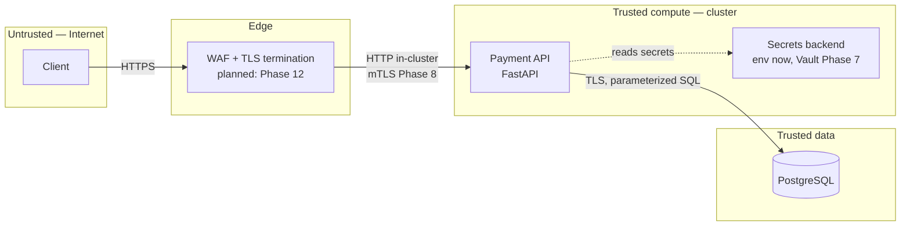

# Threat Model — SecurePay Payment API (STRIDE)

> Status: **DRAFT**. Started in Phase 1 alongside the API, finalized in
> Phase 13. Mitigations marked *(planned: Phase N)* are not implemented yet.

## Scope

This model covers the payment API service only (`app/`): authentication,
transaction create/read, and its data store. Platform-level controls
(cluster, mesh, cloud) are referenced where they mitigate an
application-level threat but are modeled in full in their own phases.

### Assets

- Authentication credentials and issued JWTs.
- Transaction records (amount, currency, status, owner).
- `card_token` values — tokenized references, **not** PANs. Real card data is
  assumed to live in a separate PCI-scope vault that this service never sees.
- Application secrets (DB credentials, JWT signing key).

### Trust boundaries

## STRIDE analysis

### Spoofing

| Threat | Vector | Mitigation | Where |
| --- | --- | --- | --- |
| Impersonate a user | Forged / replayed JWT | Signature verification, `exp`/`iat` required, short 15-min TTL | `security/jwt.py` |
| `alg=none` / algorithm confusion | Strip or swap the token algorithm | Fixed algorithm allowlist passed to `decode()`; header `alg` never trusted | `security/jwt.py`, `config.py` |
| Service impersonation inside the cluster | Rogue workload calls the API | Workload identity via mTLS + AuthorizationPolicy *(planned: Phase 8)* | — |

### Tampering

| Threat | Vector | Mitigation | Where |
| --- | --- | --- | --- |
| SQL injection | Malicious input in query params/body | ORM with bound parameters only; no string concatenation | `services/` |
| Malformed / hostile payloads | Bad types, out-of-range money, bad UUIDs | Pydantic validation, currency allowlist, `Numeric(18,2)`, positive-amount constraint | `schemas/` |
| Tampered container image | Supply-chain swap of the running image | Image signing + admission verification *(planned: Phase 10 / Kyverno Phase 6)* | — |
| Runtime binary/file tampering | Write to app filesystem | Read-only rootfs, non-root user *(container Phase 2, PSA Phase 5)* | `Dockerfile` (partial) |

### Repudiation

| Threat | Vector | Mitigation | Where |
| --- | --- | --- | --- |
| Deny performing an action | No trail of who did what | Structured logs with `request_id`, login success/failure, transaction-created events | `middleware.py`, routers |
| Log tampering to hide activity | Edit or drop logs | Centralized shipping to Loki + cloud audit via CloudTrail *(planned: Phase 11 / 12)* | — |

### Information disclosure

| Threat | Vector | Mitigation | Where |
| --- | --- | --- | --- |
| Cardholder data exposure | Store/return/log a PAN | Tokenization: only `card_token` references are handled; PAN never enters scope | `models/`, `schemas/` |
| Secrets leak | Hardcoded creds / secrets in logs | Secrets from env (Vault in Phase 7); log processor redacts sensitive keys | `logging_config.py` |
| Sensitive data in logs | Log a token, password, or card reference | Redaction processor + discipline: log `transaction_id`, never `card_token` | `logging_config.py`, routers |
| User enumeration | Different response for unknown vs wrong password | Identical 401 + bcrypt timing parity on the failed path | `routers/auth.py`, `services/auth_service.py` |
| Cross-origin data theft | Permissive CORS | Strict origin allowlist, methods limited to GET/POST | `main.py` |
| Info leak via headers/docs | Server banner, open Swagger in prod | Security headers, `Server` stripped, docs disabled outside `local` | `middleware.py`, `main.py` |
| Transport interception | Plaintext traffic | TLS to DB and at edge; in-cluster mTLS *(planned: Phase 4 / 8)* | — |

### Denial of service

| Threat | Vector | Mitigation | Where |
| --- | --- | --- | --- |
| Credential-stuffing / brute force | Flood `/auth/login` | Per-IP rate limit on login (5/min) + default limit | `ratelimit.py`, `routers/auth.py` |
| Unbounded result sets | Request huge `limit` | Pagination bounded to 1–100 | `schemas/transaction.py` |
| Resource exhaustion | Crash-loop / memory pressure | CPU/memory limits *(planned: Phase 5)*; WAF rate rules *(Phase 12)* | — |

### Elevation of privilege

| Threat | Vector | Mitigation | Where |
| --- | --- | --- | --- |
| IDOR — read another user's transaction | Guess/enumerate transaction IDs | Every query scoped by `owner_id`; non-owned id returns 404, not 403 | `services/transaction_service.py` |
| Container breakout / root abuse | Run as root, extra capabilities | Non-root user *(read-only FS + dropped caps: Phase 2 / 5)* | `Dockerfile` (partial) |
| Over-broad access | Wide DB/cloud permissions | Least-privilege DB user, RBAC, IAM/IRSA *(planned: Phase 4/5/7)* | — |

## Residual risk and assumptions

- No TLS in local dev (compose is loopback-only); TLS is a Phase 4/8 concern.
- Rate limiting keys on client IP; correct behavior behind a proxy needs a
  trusted `X-Forwarded-For` chain, wired with the ingress in a later phase.
- Secrets currently come from environment variables; this is acceptable for
  local dev only and is replaced by Vault + IRSA in Phase 7.
- The model assumes the tokenization vault (holding real PANs) exists and is
  out of scope for this repository.
